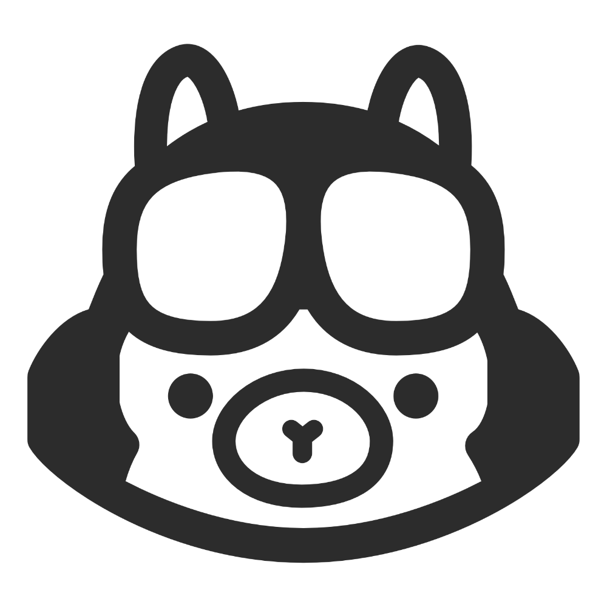

# Ollama for Copilot

[](https://github.com/selfagency/ollama-copilot/actions/workflows/ci.yml) [](https://codecov.io/gh/selfagency/ollama-copilot)

<p align="center">
  
</p>

<p align="center">
  <strong>Run Ollama models locally and in the cloud within GitHub Copilot Chat</strong>
</p>

<p align="center">
  <a href="https://ollama.ai">🌐 Ollama</a> •
  <a href="https://github.com/ollama/ollama">📖 GitHub Repo</a> •
  <a href="https://ollama.ai/library">📚 Model Library</a>
</p>

## ✨ Features

- 🧠 **All Models** - Use any model from the [Ollama Library](https://ollama.ai/library), including Cloud models (requires API key), within the Copilot chat interface
- 🛠️ **Model Management** - Pull, run, inspect, stop, and delete models from a custom Ollama sidebar
- 💬 **Chat Participant** - Invoke `@ollama` directly in Copilot Chat for a dedicated, history-aware conversation with your local model
- 📝 **Modelfile Management** - Create, edit, and build custom Ollama modelfiles with syntax highlighting, hover docs, and autocomplete
- 🤖 **Code Completions** - Use local models to provide inline code completions
- 🔧 **Tool Calling** - Tool support for agentic workflows with compatible models (access IDE functions, MCP servers, custom skills, etc.)
- 🖼️ **Vision Support** - Image input for models with vision capabilities
- 🏠 **Local Execution** - Local models run on your machine with full privacy—no data leaves your computer
- ⚡ **Streaming** - Real-time response streaming for faster interactions

## 🔧 Requirements

- **VS Code** 1.109.0 or higher
- **GitHub Copilot Chat** extension installed
- **Ollama** installed and running locally ([Download](https://ollama.ai/download)) OR access to a remote Ollama instance

## 🚀 Installation

1. **Install Ollama** - Download and install from [ollama.ai](https://ollama.ai/download)
2. **Start Ollama** - Run `ollama serve` (or use the system app)
3. **Install Extension** - Install from VS Code Marketplace (or install the `.vsix` file)
4. **Pull a Model** - Use the sidebar to pull a model, or run `ollama pull llama2` from terminal

The extension will auto-detect your local Ollama instance at `http://localhost:11434` by default.

## ⚙️ Configuration

Open VS Code Settings (`Ctrl+,` / `Cmd+,`) and search for "Ollama":

- **`ollama.host`** - Ollama server address (default: `http://localhost:11434`)
- **`ollama.contextLength`** - Context window size for models (default: `1024`)
- **`ollama.streamLogs`** - Stream Ollama server logs to output channel (default: `true`)
- **`ollama.completionModel`** - Model used for inline code completions (e.g. `qwen2.5-coder:1.5b`). Leave empty to disable.
- **`ollama.enableInlineCompletions`** - Enable or disable inline code completions (default: `true`)

To use a remote Ollama instance, update `ollama.host` to point to your remote server.

## 💬 Usage

### Model Picker

To use an Ollama model in Copilot Chat without the `@ollama` handle:

1. Open **GitHub Copilot Chat** panel in VS Code
2. Click the **model selector** dropdown
3. Choose an **Ollama** model (local or from library)
4. Start chatting!

### Chat Participant

Type `@ollama` in any Copilot Chat input to direct the conversation to your local Ollama instance:

```text
@ollama explain the architecture of this TypeScript project
```

The participant is sticky — once invoked, it stays active for the thread.

### Inline Code Completions

Set `ollama.completionModel` to a locally-installed model to get inline code completions as you type. Smaller, fast models work best:

- `qwen2.5-coder:1.5b`
- `deepseek-coder:1.3b`
- `starcoder2:3b`

Completions use fill-in-the-middle (FIM) when the model supports it, and can be toggled with `ollama.enableInlineCompletions`.

### Sidebar: Model Management

The Ollama sidebar provides three sections:

#### Local Models

- View installed models on your system
- Right-click to run, stop, or delete models
- Monitor active models in real-time
- View context window and memory usage

#### Library Models

- Browse 200+ pre-configured models from [ollama.ai/library](https://ollama.ai/library)
- Sort by recency or name
- Click to view details, preview capabilities, or pull to local system

### Modelfile Manager

The **Modelfile Manager** is a dedicated sidebar pane for creating and managing custom Ollama modelfiles.

#### Creating a new Modelfile

Click the **+** button in the Modelfile Manager pane header. An interactive wizard will guide you through:

1. **Name** — enter a name for the modelfile (e.g. `pirate-bot`)
2. **Base model** — pick a model from your locally installed Ollama models
3. **System prompt** — describe the AI persona or task

The wizard creates the file, pre-populates it with the chosen settings, and opens it in the editor.

#### Building a Modelfile

Right-click any `.modelfile` in the pane and choose **Build Modelfile** (or use the command palette: `Ollama: Build Modelfile`). This runs `ollama create` with the file and streams progress in a VS Code notification.

#### Syntax support

All `.modelfile` files receive:

- **Syntax highlighting** — keywords (`FROM`, `PARAMETER`, `SYSTEM`, `TEMPLATE`, `ADAPTER`, `LICENSE`, `MESSAGE`), parameter names, numbers, strings, and comments
- **Hover documentation** — hover over any keyword to see its description and usage
- **Autocomplete** — suggestions for Modelfile keywords and common parameter names

```modelfile
# Modelfile — pirate-bot
FROM llama3.2:3b

SYSTEM """You are a helpful pirate assistant. Arr!"""

PARAMETER temperature 0.7
PARAMETER num_ctx 4096
```

See the [Ollama Modelfile Docs](https://github.com/ollama/ollama/blob/main/docs/modelfile.md) for the full syntax reference.

#### Configuration

- **`ollama.modelfilesPath`** — folder where modelfiles are stored (default: `~/.ollama/modelfiles`)

## 🛡️ Privacy & Security

- Your models and conversations run **completely locally** - no data is sent to external services
- The extension communicates only with your local Ollama instance (or your specified remote instance)
- No telemetry, tracking, or data collection
- Authentication tokens (if using a remote instance) are stored securely using VS Code's encrypted secrets API

For more information on Ollama's security and privacy model, see the [Ollama GitHub repository](https://github.com/ollama/ollama).

## 🛠️ Development

### Prerequisites

- [Node.js](https://nodejs.org/) 20+
- [pnpm](https://pnpm.io/) (version pinned in `package.json`)
- [VS Code](https://code.visualstudio.com/) 1.109.0+

### Build

```bash
pnpm install
pnpm run compile        # type-check + lint + bundle
pnpm run watch          # parallel watch for type-check and bundle
```

### Testing

```bash
pnpm test               # unit tests (Vitest)
pnpm run test:coverage  # unit tests with coverage (target: 85%)
pnpm run test:extension # VS Code integration tests
pnpm run lint           # static analysis (oxlint)
```

### Debugging

Open the project in VS Code and press **F5** to launch the Extension Development Host with the extension loaded.

## 📄 License

MIT License - See [LICENSE](LICENSE) for details.

Maintained by [Daniel Sieradski](https://self.agency) ([@selfagency](https://github.com/selfagency)).

## 📚 Resources

- [Ollama GitHub](https://github.com/ollama/ollama) - Main Ollama repository
- [Ollama Model Library](https://ollama.ai/library) - Browse available models
- [Ollama API Docs](https://github.com/ollama/ollama/blob/main/docs/api.md) - REST API documentation
- [Ollama Modelfile Docs](https://github.com/ollama/ollama/blob/main/docs/modelfile.md) - Create custom models
- [VS Code Language Model API](https://code.visualstudio.com/api/references/vscode-api#LanguageModelsAPI) - Extension API reference
